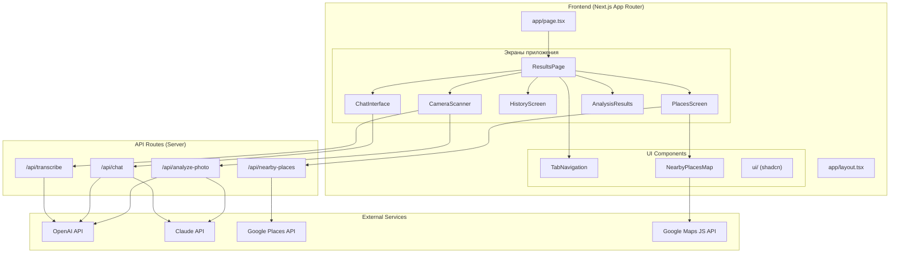
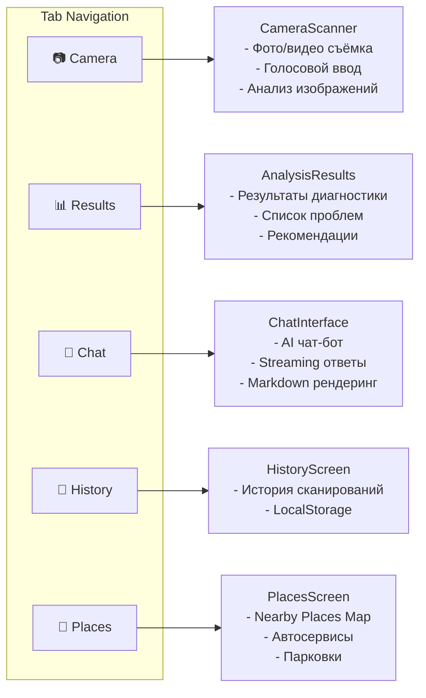
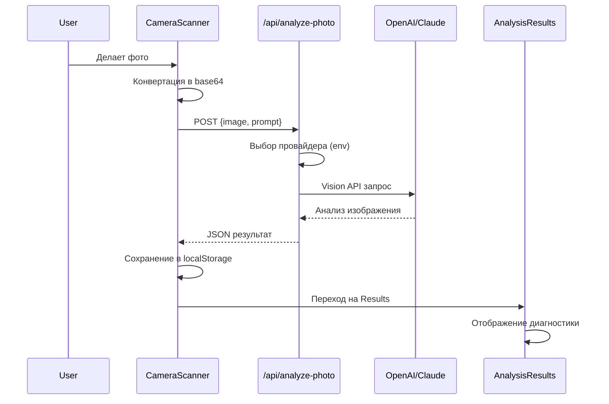
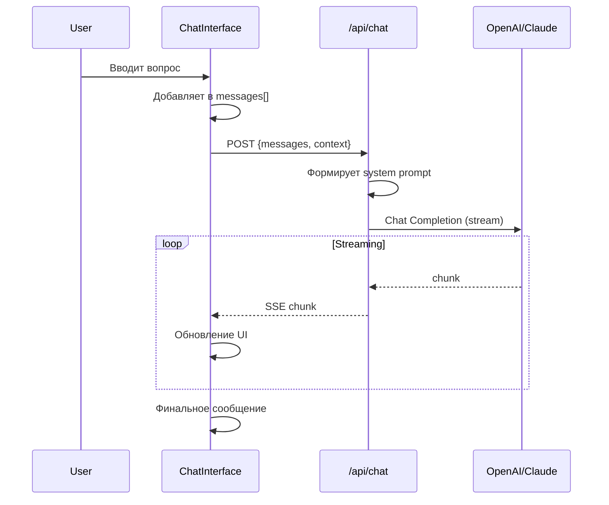
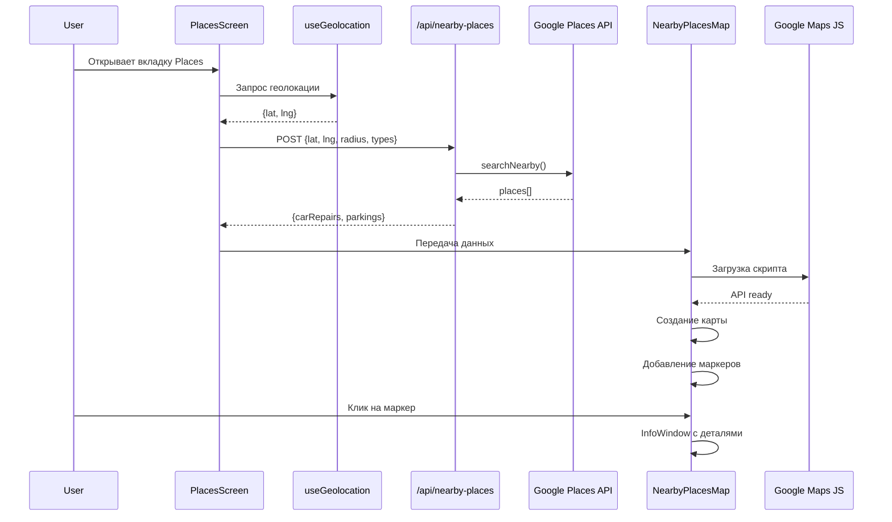

# Архитектура проекта MechanicAI

AI-powered приложение для диагностики автомобилей с использованием камеры, чата и карты ближайших сервисов.

## Общая структура



## Навигация и экраны



## Поток данных анализа фото



## Поток чата



## Поток Places (карта)



## Структура файлов

```
camera-scanning-screen/
├── app/                          # Next.js App Router
│   ├── api/                      # API Routes (серверные)
│   │   ├── analyze-photo/        # Анализ фото через Vision AI
│   │   ├── chat/                 # AI чат
│   │   ├── nearby-places/        # Google Places API
│   │   └── transcribe/           # Транскрипция аудио
│   ├── layout.tsx                # Root layout + metadata
│   └── page.tsx                  # Главная страница
│
├── components/                   # React компоненты
│   ├── ui/                       # shadcn/ui компоненты
│   ├── results-page.tsx          # Главный контейнер с табами
│   ├── camera-scanner.tsx        # Камера + анализ
│   ├── chat-interface.tsx        # AI чат
│   ├── history-screen.tsx        # История
│   ├── places-screen.tsx         # Nearby Places
│   ├── nearby-places-map.tsx     # Google Maps
│   └── tab-navigation.tsx        # Нижняя навигация
│
├── lib/                          # Утилиты и конфигурация
│   ├── config/places.ts          # Конфиг Google Places
│   ├── hooks/useGeolocation.ts   # Хук геолокации
│   └── utils/                    # Вспомогательные функции
│
└── public/                       # Статические файлы
    └── markers/                  # SVG маркеры для карты
```

## Стек технологий

| Слой | Технологии |
|------|------------|
| **Frontend** | Next.js 16, React 19, TypeScript |
| **UI** | Tailwind CSS 4, shadcn/ui, Radix UI |
| **Maps** | Google Maps JavaScript API, Google Places API (New) |
| **AI** | OpenAI GPT-4o (Vision + Chat), Claude (опционально) |
| **State** | React hooks, localStorage |
| **Deploy** | Vercel |

## Переменные окружения

```bash
# AI Providers
OPENAI_API_KEY=sk-...
CLAUDE_API_KEY=sk-ant-...
VISION_API_PROVIDER=openai    # openai | claude
CHAT_API_PROVIDER=openai      # openai | claude

# Google APIs
GOOGLE_PLACES_API_KEY=...              # Server-side (Places API)
NEXT_PUBLIC_GOOGLE_MAPS_API_KEY=...    # Client-side (Maps JS API)
NEXT_PUBLIC_GOOGLE_MAPS_MAP_ID=...     # Map styling ID
```

## Ключевые особенности

1. **Lazy Loading** — PlacesScreen загружается только при первом посещении вкладки
2. **Streaming** — Ответы чата приходят в режиме реального времени
3. **Offline-first** — История сохраняется в localStorage
4. **Responsive** — Адаптивный дизайн для мобильных устройств
5. **PWA-ready** — Поддержка viewport-fit для iPhone notch
